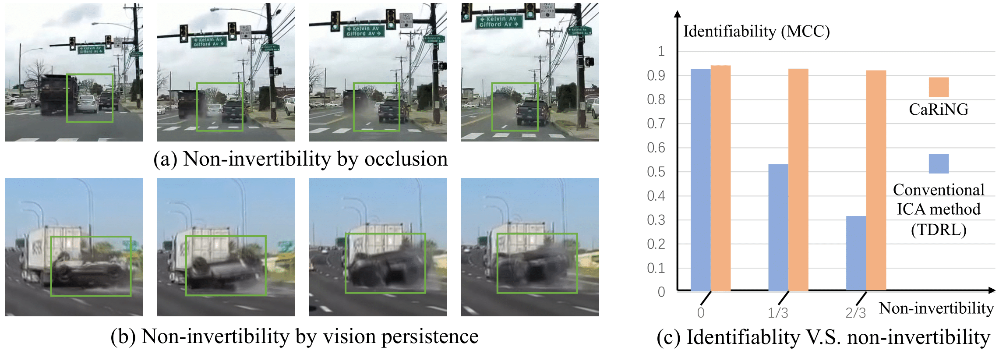
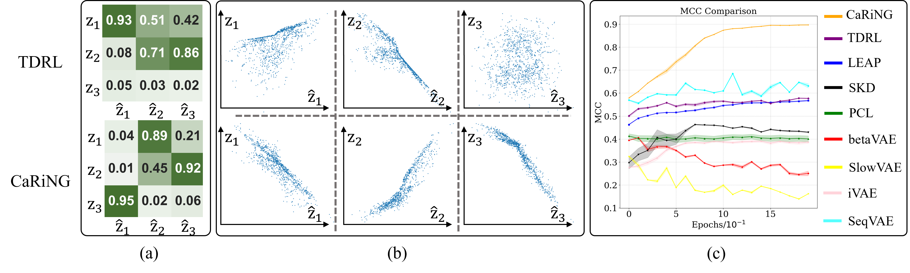

# CaRiNG: Learning Temporal Causal Representation under Non-Invertible Generation Process [ICML 2024]


> [**CaRiNG: Learning Temporal Causal Representation under Non-Invertible Generation Proces**](https://arxiv.org/abs/2401.14535)
> Guangyi Chen*, Yifan Shen*, Zhenhao Chen*, Xiangchen Song, Yuewen Sun, Weiran Yao, Xiao Liu, Kun Zhang

    

Official implementation of the paper "[CaRiNG: Learning Temporal Causal Representation under Non-Invertible Generation Proces](https://arxiv.org/abs/2401.14535)".
<hr />


## Highlights



> **Abstract**: Identifying the underlying time-delayed latent causal processes in sequential data is vital for grasping temporal dynamics and making downstream reasoning. While some recent methods can robustly identify these latent causal variables, they rely on strict assumptions about the invertible generation process from latent variables to observed data. However, these assumptions are often hard to satisfy in real-world applications containing information loss. For instance, the visual perception process translates a 3D space into 2D images, or the phenomenon of persistence of vision incorporates historical data into current perceptions. To address this challenge, we establish an identifiability theory that allows for the recovery of independent latent components even when they come from a nonlinear and non-invertible mix. Using this theory as a foundation, we propose a principled approach, CaRiNG, to learn the **Ca**usal **R**epresentat**i**on of **N**on-invertible **G**enerative temporal data with identifiability guarantees. Specifically, we utilize temporal context to recover lost latent information and apply the conditions in our theory to guide the training process. Through experiments conducted on synthetic datasets, we validate that our CaRiNG method reliably identifies the causal process, even when the generation process is non-invertible. Moreover, we demonstrate that our approach considerably improves temporal understanding and reasoning in practical applications.

## Main Contributions
- To the best of our understanding, this paper presents the first identifiability theorem that accommodates a non-invertible generation process, which complements the existing body of the nonlinear ICA theory.

- We present a principled approach, CaRiNG, to learn the latent causal representation from temporal data under non-invertible generation processes with identifiability guarantees, by integrating temporal context information to recover the lost information.

- Our evaluations across synthetic and real-world datasets demonstrate the \caring's effectiveness for learning the identifiable latent causal representation, leading to enhancements in video reasoning tasks.

## Results


> **Qualitative comparisons between baselines (especially TDRL) and CaRiNG in the setting of Non-invertible Generation.** (a) MCC matrix for all 3 latent variables; (b) The scatter plots between the estimated and ground-truth latent variables (only the aligned variables are plot); (c) The validation MCC curves of \ourmeos and other baselines.

| Settings\Methods | NG                      | NG-TDMP                 |
|------------------|-------------------------|-------------------------|
| CaRiNG           | $0.933 \textpm 0.010$ | $0.921 \textpm 0.010$ |
| TDRL             | $0.627 \textpm 0.009$ | $0.837 \textpm 0.068$ |
| LEAP             | $0.651 \textpm 0.019$ | $0.704 \textpm 0.005$ |
| SlowVAE          | $0.362 \textpm 0.041$ | $0.398 \textpm 0.037$ |
| PCL              | $0.507 \textpm 0.091$ | $0.489 \textpm 0.095$ |
| betaVAE          | $0.551 \textpm 0.007$ | $0.437 \textpm 0.021$ |
| SKD              | $0.489 \textpm 0.077$ | $0.381 \textpm 0.084$ |
| iVAE             | $0.391 \textpm 0.686$ | $0.553 \textpm 0.097$ |
| SequentialVAE    | $0.750 \textpm 0.035$ | $0.847 \textpm 0.019$ |

> **MCC scores** (with standard deviations over 4 seeds) of CaRiNG and baselines on NG and NG-TDMP settings.

<hr />

## Training and Evaluation
We provide bash scripts in `caring/scripts/run_caring.sh` to generate results for experiment. Please follow the instructions below to run the code.

### Download
If you wish to download the code along with the datasets  and , please make sure you have `git-lfs` installed.
```bash
git lfs install
```

Then download the code with datasets.
```bash
git clone git clone git@github.com:sanshuiii/CaRiNG.git
```

You can also download the code only without datasets in case of network issue.
```bash
GIT_LFS_SKIP_SMUDGE=1 git clone git@github.com:sanshuiii/CaRiNG.git
```

### Installation
To install it, a version of `Python>=3.7` is required. Please kindly note that the current implementation of CaRiNG requires a GPU.
```bash
cd CaRiNG
conda create -n caring python=3.7
pip install -e .
```

### Configuration
Modify `root_path` to your repo path (where you are now) in [caring/configs/ug.yaml](caring/configs/ug.yaml) and [caring/configs/ug_tdmp.yaml](caring/configs/ug_tdmp.yaml) respectively.

### Run
Go to the ```scripts``` folder and run the following command to reproduce the results.
```bash
bash run_caring.sh
```

### Datasets
You may also generate your own datasets. Go to the folder  ```data_generator``` and run the following command to generate the datasets. The argument $12$ can be replaced with any seed.
- NG: 
```bash
python data_generator/NG.py 12
```
- NG-TDMP: 
```bash
python data_generator/NG-TDMP.py 12
```


